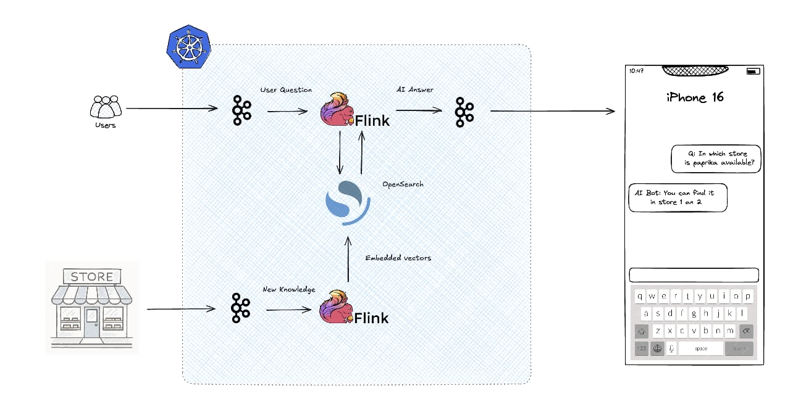

# Flink-Powered Real-Time LLM with Streaming RAG Memory




## Project Overview

This project demonstrates a low-latency, scalable LLM application that both:
1. **Responds to user questions in real time** (using a Flink streaming job).
2. **Updates its retrieval-augmented generation (RAG) memory in real time** (via another Flink job that ingests new information, generates embeddings, and stores them in OpenSearch).

Flink and Kafka are used to orchestrate continuous streams of questions and knowledge updates, ensuring that newly ingested facts become immediately available for retrieval before generating an answer. The core components are:

- **AiJob**: Consumes user questions from a Kafka topic, retrieves relevant documents (stored as vector embeddings in OpenSearch), constructs a prompt, and sends it to an OpenAI-powered chat model. Answers are written back to a Kafka topic.
- **StreamingStoreKnowledge**: Listens to a Kafka topic of “knowledge updates,” generates vector embeddings using OpenAI’s embedding API, and writes them to an OpenSearch index. Each ingested document becomes searchable within seconds.
- **OpenSearch**: Acts as the vector store, indexing embeddings from `StreamingStoreKnowledge` and serving nearest-neighbor (k-NN) queries for the AiJob retrieval step.
- **Kafka & ZooKeeper**: Provide durable, partitioned message streams for questions (`questions` topic) and knowledge updates (`knowledge_updates` topic). AiJob writes answers to the `answers` topic.
- **Flink**: Orchestrates both streaming pipelines (questions→LLM and knowledge→OpenSearch) with exactly-once or at-least-once delivery guarantees. It parallelizes embedding generation, retrieval, and inference across a cluster of TaskManagers.

---

## Benefits of Flink & Kafka for LLM Workloads

- **Low Latency & High Throughput**  
  Flink’s event-driven streaming engine minimizes per-record processing latency. As questions and new facts arrive, each component processes them in sub-second time (subject to OpenAI/API latency). Kafka’s partitioning allows horizontal scaling of both question ingestion and knowledge ingestion streams.

- **Stateful Exactly-Once Semantics (Optional)**  
  Flink can be configured for checkpointing and state fault tolerance. In high-availability production deployments, this ensures that no question or knowledge update is lost and that vector store state remains consistent even if jobs restart.

- **Horizontal Scalability**  
  Both Flink and Kafka naturally scale out. You can add TaskManagers to process more questions or ingest more knowledge partitions. Similarly, Kafka partitions can be rebalanced across brokers as load grows.

- **Modular, Decoupled Components**  
  Separating “question→LLM” and “knowledge ingestion” streams into different Flink jobs keeps concerns isolated. New ingestion logic (e.g. extracting structured fields or ingesting PDFs) can be deployed without touching the inference job. Likewise, you can update the prompt template or LLM model without rebuilding the ingestion job.

- **Real-Time RAG Memory**  
  By integrating a streaming ingestion job with a vector store, new facts become available to the LLM almost instantly. This contrasts with batch re-indexing, where fresh knowledge might take minutes or hours to appear in retrieval.

---

## Repository Structure

```

flink-rag-openai-langchain4j/
├── Dockerfile
├── docker-compose.yml
├── pom.xml
├── README.md
├── src/
│   ├── main/
│   │   ├── java/
│   │   │   └── org/example/
│   │   │       ├── AiJob.java
│   │   │       ├── StreamingStoreKnowledge.java
│   │   │       ├── RAG.java
│   │   │       ├── Variables.java
│   │   │       ├── EmbeddingConfig.java
│   │   │       └── OpenSearchConnection.java
│   │   └── resources/
│   │       └── features.json
│   └── test/
│       └── ... (unit tests if any)
└── jobs/                 # (optional) host directory for Flink lib mount
└── AiJob-0.1.jar     # Place-built fat JARs here for Docker bind-mount

````

- **AiJob.java**: Flink job that reads from Kafka `questions`, retrieves relevant context using RAG, calls OpenAI chat, and writes answers to Kafka `answers`.
- **StreamingStoreKnowledge.java**: Flink job that reads from Kafka `knowledge_updates`, generates embeddings for new text segments, and writes them to OpenSearch.
- **RAG.java**: Retrieval logic used by AiJob. Embeds incoming question, runs a vector search in OpenSearch, and formats a prompt.
- **Variables.java**: Holds environment variable lookups (e.g., `OPENAI_API_KEY`, OpenSearch host/port, index name).
- **EmbeddingConfig.java**: Defines a single source of truth for the embedding model name, embedding dimension, and index name.
- **OpenSearchConnection.java**: Factory for creating a configured `OpenSearchClient` pointing at the running OpenSearch node.

---

## Prerequisites

1. **Docker & Docker Compose**   

2. **Java 17 or 11**  

3. **Maven 3.8+**  

4. **OpenAI API Key**  
   - Set environment variable `OPENAI_API_KEY` with a valid key from [platform.openai.com](https://platform.openai.com/account/api-keys).

---

## Setup & Deployment

### 1. Clone & Build

```bash
git clone https://github.com/anelook/flink-rag-openai-langchain4j.git
cd flink-rag-openai-langchain4j
mvn -DskipTests clean package
````

This produces a fat-JAR at `target/AiJob-0.1.jar` containing all dependencies (LangChain4j, Flink connectors, OpenSearch client, etc.).

### 2. Configure Environment Variables

Create a file named `.env` in the project root with the following:

```text
# .env
OPENAI_API_KEY=<your_openai_api_key>
OPENSEARCH_INITIAL_ADMIN_PASSWORD=changeme
```

> **Note**: Do not commit this file to version control.
> Adjust `OPENSEARCH_INITIAL_ADMIN_PASSWORD` to a strong password if security is enabled.

### 3. Docker Compose Configuration

The `docker-compose.yml` defines four main services:

1. **zookeeper**
2. **kafka**
3. **opensearch-node1**
4. **opensearch-dashboards** (UI)
5. **jobmanager** (Flink JobManager)
6. **taskmanager** (Flink TaskManagers)

> * The `Dockerfile` (in project root) is based on `flink:1.18.1-scala_2.12-java11` and copies all JARs from `./jars` into `/opt/flink/lib/`.
> * Place `target/AiJob-0.1.jar` and any connector jars (e.g. `flink-connector-kafka-3.1.0-1.18.jar`, `kafka-clients-*.jar`) into `./jars` before starting.

### 4. Build & Bring Up Services

1. Copy the fat JAR and connector JARs into the `jars` folder:

   ```bash
   mkdir -p jars
   cp target/AiJob-0.1.jar jars/
   # If you haven’t done so already:
   cp <path-to-flink-connector-kafka-*.jar> jars/
   cp <path-to-kafka-clients-*.jar> jars/
   ```

2. Build the custom Flink image and start everything:

   ```bash
   docker compose build
   docker compose up -d
   ```

3. Verify that all containers are running:

   ```bash
   docker compose ps
   ```

   You should see services: `zookeeper-1`, `kafka`, `opensearch-node1`, `opensearch-dashboards`, `jobmanager`, and three `taskmanager` replicas.

4. Open dashboards:

   * **Flink UI**: [http://localhost:8089](http://localhost:8089)
   * **OpenSearch Dashboards**: [http://localhost:5601](http://localhost:5601)

---

## Building & Running Each Part

### A. Running AiJob (Real-Time Question → Answer)

1. **Create Kafka topics** (if not auto-created):

   ```bash
   docker exec -it kafka \
     kafka-topics.sh --create --topic questions --bootstrap-server localhost:9092 --partitions 1 --replication-factor 1

   docker exec -it kafka \
     kafka-topics.sh --create --topic answers --bootstrap-server localhost:9092 --partitions 1 --replication-factor 1

   ```

2. **Submit AiJob to Flink** (if not auto-detected in `/opt/flink/lib`):

   ```bash
   $FLINK_HOME/bin/start-cluster.sh   # only if not already running in Docker
   flink run -c org.example.AiJob /opt/flink/usrlib/AiJob-0.1.jar
   ```

3. **Produce questions** (from host):

   ```bash
   docker exec -it kafka \
     kafka-console-producer.sh --bootstrap-server localhost:9092 --topic questions
   > What do I do if it is dark?
   > How to clean my bathroom?
   > How to make a cup of cappuccino?
   ```

4. **Consume answers**:

   ```bash
   docker exec -it kafka \
     kafka-console-consumer.sh --bootstrap-server localhost:9092 --topic answers --from-beginning
   ```

   You should see each answer streamed back from the LLM.

### B. Running StreamingStoreKnowledge (Real-Time Knowledge Ingestion)

1. **Create Kafka topic**:

   ```bash
   docker exec -it kafka \
     kafka-topics.sh --create --topic knowledge_updates --bootstrap-server localhost:9092 --partitions 1 --replication-factor 1
   ```

2. **Submit StreamingStoreKnowledge** (if not auto-detected):

   ```bash
   flink run -c org.example.StreamingStoreKnowledge /opt/flink/usrlib/AiJob-0.1.jar
   ```

3. **Produce new knowledge**:

   ```bash
   docker exec -it kafka \
     kafka-console-producer.sh --bootstrap-server localhost:9092 --topic knowledge_updates
   > The Eiffel Tower was completed in 1889.
   > Stainless steel can be cleaned with vinegar and water.
   ```

4. **Verify indexing in OpenSearch**:

   ```bash
   curl -u admin:${OPENSEARCH_INITIAL_ADMIN_PASSWORD} \
     -X GET "localhost:9200/big_store/_search?pretty" -H "Content-Type: application/json" -d'
   {
     "query": { "match_all": {} }
   }'
   ```

   You should see vector documents with a `"text"` field matching the lines you sent.

### C. Testing RAG Interaction

Once both jobs are running:

1. Produce a **knowledge update** (so new facts are immediately available):

   ```bash
   docker exec -it kafka \
     kafka-console-producer.sh --bootstrap-server localhost:9092 --topic knowledge_updates
   > The capital of France is Paris.
   ```

2. Produce a **question referencing that fact**:

   ```bash
   docker exec -it kafka \
     kafka-console-producer.sh --bootstrap-server localhost:9092 --topic questions
   > What is the capital of France?
   ```

4. Consume answers:

   ```bash
   docker exec -it kafka \
     kafka-console-consumer.sh --bootstrap-server localhost:9092 --topic answers --from-beginning
   ```

   The LLM should answer “The capital of France is Paris,” demonstrating that the newly ingested fact was retrieved and used.